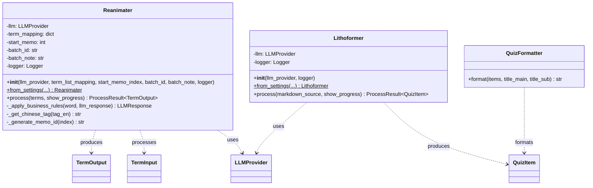

# Memosyne 架构文档

**版本**: v0.7.1
**日期**: 2025-10-11

本文档详细描述 Memosyne 项目的架构设计、设计决策和各种架构图表。

---

## 目录

- [架构概览](#架构概览)
- [分层架构图](#分层架构图)
- [系统架构图](#系统架构图)
- [UML 类图](#uml-类图)
- [时序图](#时序图)
- [数据流图](#数据流图)
- [设计决策](#设计决策)

---

## 架构概览

Memosyne 采用经典的**分层架构**（Layered Architecture）和 **SOLID 原则**，确保代码的可维护性、可测试性和可扩展性。

### 核心设计原则

1. **单一职责原则** (SRP) - 每个模块只负责一个功能
2. **开放封闭原则** (OCP) - 对扩展开放，对修改封闭
3. **里氏替换原则** (LSP) - 子类可以替换父类
4. **接口隔离原则** (ISP) - 使用细粒度接口
5. **依赖倒置原则** (DIP) - 依赖抽象而非具体实现

### 架构特点

- ✅ **无全局状态** - 所有依赖通过构造函数注入
- ✅ **类型安全** - 使用 Pydantic 进行运行时验证
- ✅ **可测试** - 每个组件都可以独立测试
- ✅ **可扩展** - 轻松添加新的 LLM Provider
- ✅ **模块化配置** - Prompts 和 Schemas 独立管理
- ✅ **Token 追踪** - 完整的 Token 使用量统计

---

## 分层架构图


---

## 系统架构图

### Reanimater Pipeline 架构


### Lithoformer Pipeline 架构


---

## UML 类图

### 核心接口和抽象类


### Pydantic 数据模型


### 服务层类图



---

## 时序图

### Reanimater 处理流程时序图


### Lithoformer 解析流程时序图


### API 调用时序图


---

## 数据流图

### Reanimater 数据流


### Lithoformer 数据流


---

## 设计决策

### 1. 为什么使用 Pydantic？

**问题**：如何确保数据的类型安全和运行时验证？

**决策**：使用 Pydantic 2.x

**理由**：
- ✅ 运行时类型验证
- ✅ 自动数据转换（如字符串 → 枚举）
- ✅ 清晰的错误信息
- ✅ IDE 类型提示支持
- ✅ JSON Schema 生成（用于 LLM）

### 2. 为什么使用 Protocol 和 ABC？

**问题**：如何定义 LLM Provider 接口？

**决策**：同时使用 Protocol（duck typing）和 ABC（显式继承）

**理由**：
- Protocol：支持鸭子类型，无需显式继承
- ABC：提供模板方法模式和共享代码
- 两者结合：既灵活又有代码复用

### 3. 为什么使用依赖注入？

**问题**：如何避免全局状态和硬编码依赖？

**决策**：通过构造函数注入所有依赖

**理由**：
- ✅ 可测试性：轻松 mock 依赖
- ✅ 灵活性：运行时选择不同实现
- ✅ 清晰性：依赖关系显式声明

示例：

```python
# ❌ 不好：全局状态
llm = OpenAI()  # 全局变量

def reanimate(word):
    return llm.call(word)  # 隐式依赖

# ✅ 好：依赖注入
class Reanimater:
    def __init__(self, llm: LLMProvider):
        self.llm = llm  # 显式依赖

    def reanimate(self, word):
        return self.llm.call(word)
```

### 4. 为什么分离 Repository 和 Service？

**问题**：如何组织数据访问和业务逻辑？

**决策**：Repository 负责 I/O，Service 负责业务逻辑

**理由**：
- ✅ 单一职责：每层只负责一件事
- ✅ 可测试：可以 mock Repository 测试 Service
- ✅ 可替换：轻松替换数据源（CSV → DB）

### 5. 为什么使用 Pydantic Settings？

**问题**：如何管理配置？

**决策**：使用 pydantic-settings 从 .env 加载配置

**理由**：
- ✅ 类型验证：配置项类型安全
- ✅ 环境变量支持：12-factor app 兼容
- ✅ 默认值管理：集中在一处
- ✅ IDE 提示：完整的类型提示

### 6. 为什么提供 CLI 和 API 两种接口？

**问题**：如何满足不同用户需求？

**决策**：同时提供交互式 CLI 和编程 API

**理由**：
- CLI：适合手动操作、测试、快速验证
- API：适合自动化、集成、批量处理
- 两者共享底层逻辑，避免重复

---

## 扩展性

### 添加新的 LLM Provider

步骤：

1. 创建新文件 `providers/new_provider.py`
2. 继承 `BaseLLMProvider`
3. 实现 `complete_prompt()` 方法
4. 在 `providers/__init__.py` 导出

无需修改其他代码！

### 添加新的数据源

步骤：

1. 创建新 Repository 类
2. 实现读写方法
3. 在 Service 中注入新 Repository

无需修改 Service 业务逻辑！

### 添加新的输出格式

步骤：

1. 创建新 Formatter 类
2. 实现 `format()` 方法
3. 在 CLI/API 中调用

无需修改解析逻辑！

---

## 性能优化

### 当前瓶颈

1. **LLM API 调用** - 网络延迟占主要时间
2. **顺序处理** - 目前是同步逐个处理

### 未来优化方向

1. **并发处理** - 使用 `asyncio` 并发调用 LLM API
2. **批量请求** - 合并多个术语到一次 API 调用
3. **缓存** - 缓存相同术语的结果
4. **重试策略** - 智能重试失败的请求

---

## 总结

Memosyne v2.0 采用现代化的 Python 架构设计，遵循 SOLID 原则和最佳实践，实现了：

✅ **高内聚低耦合** - 每层职责清晰
✅ **易于测试** - 依赖注入，可 mock
✅ **易于扩展** - 新增 Provider 无需修改现有代码
✅ **类型安全** - Pydantic 运行时验证
✅ **文档完善** - 代码即文档

这是一个**生产级别**的架构，可以支撑长期维护和功能扩展。

---

**文档版本**: 1.1
**作者**: Memosyne Team
**最后更新**: 2025-10-11
