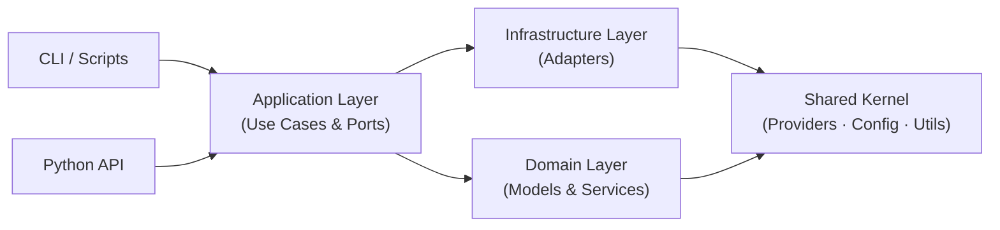

# Memosyne

<div align="center">

**基于 LLM 的术语处理和 Quiz 解析工具包**

[](https://www.python.org/)
[](LICENSE)
[]()
[]()

*领域驱动设计、类型安全、生产就绪的 LLM 工作流工具*

[特性](#-特性) • [快速开始](#-快速开始) • [架构](#-架构详解) • [API 指南](#-api-使用指南) • [安装](#-安装)

</div>

---

## 📖 简介

Memosyne 是一个基于领域驱动设计（DDD）和六边形架构的 LLM 术语处理和 Quiz 解析工具包，提供两个核心功能：

### 🔤 **Reanimator - 术语重生器**
将术语列表（英文单词 + 中文释义）扩展为完整的记忆卡片信息：
- 音标（IPA）
- 词性（POS）
- 英文定义（EnDef）
- 例句（Example）
- 词根词缀（PPfix/PPmeans）
- 领域标签（TagEN/TagCN）
- Memo ID 和批次管理

### 📝 **Lithoformer - Quiz 重塑器**
将 Markdown 格式的 Quiz 文档解析为结构化的 ShouldBe.txt 格式，支持：
- 多选题（MCQ）
- 填空题（CLOZE）
- 排序题（ORDER）
- 自动题目验证和格式化

---

## ✨ 特性

### 🏗️ **生产级架构**

- ✅ **DDD + Hexagonal Architecture** - 领域驱动设计 + 六边形架构
- ✅ **Bounded Contexts** - Reanimator 和 Lithoformer 作为独立子域
- ✅ **Ports & Adapters** - 清晰的端口和适配器分离
- ✅ **Dependency Inversion** - 核心业务不依赖外部实现
- ✅ **SOLID 原则** - 单一职责、开放封闭、依赖倒置
- ✅ **类型安全** - Pydantic 2.x 运行时验证
- ✅ **依赖注入** - 无全局状态，完全可测试
- ✅ **统一日志系统** - 使用 logging 模块，支持多种输出格式
- ✅ **Token 追踪** - 完整的 Token 使用量统计和实时显示

### 🔌 **灵活扩展**

- ✅ 支持 **OpenAI** 和 **Anthropic** 双 Provider
- ✅ 统一的 LLM 接口，轻松添加新 Provider
- ✅ 可配置的模型、温度、重试策略
- ✅ 子域独立管理业务逻辑（Prompts/Schemas）

### 💻 **多种使用方式**

- ✅ **交互式 CLI** - 向导式操作
- ✅ **编程 API** - 在代码中直接调用
- ✅ **模块执行** - `python -m memosyne.reanimator.cli.main`
- ✅ **便捷脚本** - `./run_reanimate.sh`, `./run_lithoform.sh`

### 📊 **完善的数据流**

- ✅ CSV 输入/输出（Reanimator）
- ✅ Markdown 输入 / TXT 输出（Lithoformer）
- ✅ 自动批次 ID 生成（格式：YYMMDD + RunLetter + Count）
- ✅ 智能文件命名（BatchID-FileName-ModelCode.ext）
- ✅ 防重名输出路径

---

### Lithoformer 输入/输出规范

**📥 输入 Markdown（每题一对代码块）**

```Question
Unlike fear, panic __________.
    a. is present oriented
    b. occurs in the absence of a "real" threat
    c. is future oriented
    d. involves autonomic nervous system (ANS) arousal
```

```Answer
b
```

- `Question` 代码块中保留题干与选项的原始排版（缩进、空行、图片占位等均可）。
- `Answer` 代码块填写标准答案：选择题写字母、填空题写正确填空（多空以逗号/换行分隔）、排序题写顺序（如 `B,A,C,D`）。
- 可在代码块前保留 `## 章节/题号` 等标题，Lithoformer 会自动带入上下文信息。
- 兼容性：历史数据使用的 ` ```Gezhi` 格式仍可解析，但建议尽快迁移到新的 `Question/Answer` 语法。

**📤 输出示例（ShouldBe.txt 片段）**

```
<b>Chapter 5 Quiz:<br>Anxiety and Obsessive-Compulsive and Related Disorders</b><br><br>[Unlike fear, panic __________.<br>A. is present oriented<br>B. occurs in the absence of a "real" threat<br>C. is future oriented<br>D. involves autonomic nervous system (ANS) arousal<br>]::(B)<br><br>[[解析::<br><div>领域：Anxiety Disorders</div><div>为什么选 b（Panic，惊恐障碍）</div><div>广场恐惧症常与惊恐障碍共病：患者害怕在难以逃离或无法得到帮助的场所再次出现惊恐发作，因此会回避公共场所。</div><div><br></div><div>相关知识：</div><div>DSM-5-TR 将惊恐障碍与广场恐惧症分列诊断，但临床筛查中两者高度共病。</div><div>惊恐障碍的核心是突发惊恐发作与对再次发作的预期性焦虑，这是促成广场恐惧情境回避的直接机制。</div><div><br></div><div>其他选项为什么不如 b：</div><div>A. 广泛性焦虑属于弥散性担忧，缺少“在难以逃离处怕惊恐发作”的机制。</div><div>C. 焦虑强调对未来威胁的预期，与广场恐惧的回避触发点耦合度较低。</div><div>D. 皮肤搔抓障碍属体聚焦重复行为，与惊恐—回避机制关系较远。</div>]]<br>
```

> 每题输出包含：原题 → 标准答案 → 自动生成的领域分析、关键知识点和错误选项逐条解析。

---

## 🚀 快速开始

### 方式 1：模块执行（推荐）

```bash
# Reanimator - 术语重生
python -m memosyne.reanimator.cli.main

# Lithoformer - Quiz 重塑
python -m memosyne.lithoformer.cli.main
```

### 方式 2：便捷脚本

```bash
# Reanimator
./run_reanimate.sh

# Lithoformer
./run_lithoform.sh
```

### 方式 3：编程 API

```python
from memosyne.api import reanimate, lithoform

# 处理术语（Reanimator）
result = reanimate(
    input_csv="terms.csv",
    start_memo_index=2700,
    model="gpt-4o-mini"
)
print(f"✅ 处理了 {result['processed_count']} 个术语")
print(f"📁 输出: {result['output_path']}")
print(f"📊 Token 使用: {result['token_usage']['total_tokens']}")

# 解析 Quiz（Lithoformer）
result = lithoform(
    input_md="quiz.md",
    model="gpt-4o-mini"
)
print(f"✅ 解析了 {result['item_count']} 道题")
print(f"📁 输出: {result['output_path']}")
print(f"📊 Token 使用: {result['token_usage']['total_tokens']}")
```

---

## 📦 安装

### 1. 克隆仓库

```bash
git clone <repository-url>
cd Memosyne
```

### 2. 创建虚拟环境

```bash
python -m venv .venv
source .venv/bin/activate  # macOS/Linux
# 或
.venv\Scripts\activate     # Windows
```

### 3. 安装依赖

```bash
pip install -r requirements.txt
```

### 4. 配置环境变量

复制 `.env.example` 文件并填入你的 API 密钥：

```bash
cp .env.example .env
# 编辑 .env 文件
```

`.env` 文件示例：

```env
# === LLM API 密钥（必填）===
OPENAI_API_KEY=your-openai-api-key-here
ANTHROPIC_API_KEY=your-anthropic-api-key-here  # 可选

# === 默认模型配置 ===
DEFAULT_LLM_PROVIDER=openai
DEFAULT_OPENAI_MODEL=gpt-4o-mini
DEFAULT_ANTHROPIC_MODEL=claude-sonnet-4-5
DEFAULT_TEMPERATURE=

# === 业务配置 ===
BATCH_TIMEZONE=America/New_York
MAX_BATCH_RUNS_PER_DAY=26
REANIMATOR_TERM_LIST_VERSION=1

# === 日志配置 ===
LOG_LEVEL=INFO
LOG_FORMAT=console
```

**注意**: `.env` 文件已在 `.gitignore` 中，绝不能提交到版本控制。

---

## 🏛️ 架构详解

### 架构概览

Memosyne v0.9.0 采用**领域驱动设计（DDD）**和**六边形架构（Hexagonal Architecture，又称端口适配器模式）**，确保代码的可维护性、可测试性和可扩展性。

#### 核心架构模式

1. **Domain-Driven Design (DDD)** - 领域驱动设计
   - **Bounded Context**（限界上下文）：Reanimator 和 Lithoformer 作为独立子域
   - **Shared Kernel**（共享内核）：业务无关的基础设施代码
   - **Layered Architecture**（分层架构）：Domain → Application → Infrastructure → CLI

2. **Hexagonal Architecture** - 六边形架构
   - **Ports**（端口）：应用层定义的接口（Protocol）
   - **Adapters**（适配器）：基础设施层的具体实现
   - **依赖倒置**：核心业务不依赖外部实现

3. **SOLID 原则**
   - 单一职责原则 (SRP)
   - 开放封闭原则 (OCP)
   - 里氏替换原则 (LSP)
   - 接口隔离原则 (ISP)
   - 依赖倒置原则 (DIP)

### DDD 分层架构

```
┌─────────────────────────────────────────────────────────┐
│                    CLI / API Layer                      │  用户接口
│              (reanimator/cli, lithoformer/cli, api.py)  │
├─────────────────────────────────────────────────────────┤
│              Infrastructure Layer (Adapters)            │  适配器实现
│    (llm_adapter, csv_adapter, file_adapter, ...)        │
├─────────────────────────────────────────────────────────┤
│           Application Layer (Use Cases + Ports)         │  业务协调
│  (ProcessTermsUseCase, ParseQuizUseCase, Ports)         │
├─────────────────────────────────────────────────────────┤
│           Domain Layer (Models + Services)              │  核心业务逻辑
│   (TermInput/Output, QuizItem, business rules)          │
├─────────────────────────────────────────────────────────┤
│        Shared Kernel (Core + Shared Infrastructure)    │  共享基础设施
│  (TokenUsage, ProcessResult, Config, LLM Providers)     │
└─────────────────────────────────────────────────────────┘
```

#### 各层职责

| 层级 | 职责 | 依赖方向 |
|------|------|---------|
| **Domain** | 核心业务逻辑、领域模型、领域服务 | 不依赖任何层 |
| **Application** | 业务流程编排、用例协调、端口定义 | 依赖 Domain |
| **Infrastructure** | 外部系统适配、LLM 调用、文件 I/O | 实现 Application Ports |
| **CLI/API** | 用户接口、依赖注入、流程调度 | 依赖所有层 |

### 核心设计原则

#### 1. 依赖倒置原则 (DIP)

**核心规则**：高层模块不依赖低层模块，都依赖抽象。

```python
# ✅ 正确：Application 层定义端口接口
class LLMPort(Protocol):
    def process_term(self, word: str, zh_def: str) -> tuple[dict, dict]:
        ...

class ProcessTermsUseCase:
    def __init__(self, llm: LLMPort):  # 依赖抽象
        self.llm = llm

# ✅ 正确：Infrastructure 层实现端口
class ReanimatorLLMAdapter:  # 实现 LLMPort
    def process_term(self, word: str, zh_def: str) -> tuple[dict, dict]:
        # 注入 Reanimator 专用的 prompts 和 schemas
        ...
```

#### 2. 子域隔离原则

**核心规则**：每个子域（Bounded Context）独立管理自己的业务逻辑。

```
Reanimator 子域：
- 领域模型：TermInput, LLMResponse, TermOutput
- 业务规则：词组标记、缩写处理、Memo ID 生成
- Prompts/Schemas：术语专用提示词和 JSON Schema

Lithoformer 子域：
- 领域模型：QuizItem, QuizOptions
- 业务规则：题目验证、Markdown 分割、标题推断
- Prompts/Schemas：Quiz 解析专用提示词和 JSON Schema
```

#### 3. Shared Kernel 原则

**核心规则**：共享内核只包含业务无关的基础设施。

```python
# ✅ 允许放入 Shared Kernel
- TokenUsage（通用数据模型）
- ProcessResult[T]（通用结果容器）
- OpenAIProvider（通用 LLM 提供商，无业务逻辑）
- BatchIDGenerator（通用批次 ID 生成器）
- Progress（通用进度条工具）

# ❌ 不允许放入 Shared Kernel
- REANIMATER_SYSTEM_PROMPT（业务相关，属于 reanimator 子域）
- LITHOFORMER_USER_TEMPLATE（业务相关，属于 lithoformer 子域）
- QuizFormatter（依赖 QuizItem 领域模型，属于 lithoformer 子域）
```

### 项目结构

```
src/memosyne/
├── core/                           # 核心层（抽象接口、核心模型）
│   ├── interfaces.py               # LLMProvider Protocol/ABC, 异常定义
│   └── models.py                   # TokenUsage, ProcessResult[T]
│
├── shared/                         # 共享内核（Shared Kernel）
│   ├── config/                     # Pydantic Settings
│   ├── utils/                      # 通用工具（batch, logger, progress, path, model_codes）
│   ├── cli/                        # CLI 提示工具
│   └── infrastructure/             # 业务无关的基础设施
│       ├── llm/                    # OpenAI/Anthropic Provider（通用）
│       ├── storage/                # CSV/TermList Repository
│       └── logging/                # 日志
│
├── reanimator/                     # Reanimator 子域（Bounded Context）
│   ├── domain/                     # 领域层
│   │   ├── models.py               # TermInput, LLMResponse, TermOutput
│   │   └── services.py             # apply_business_rules, get_chinese_tag, generate_memo_id
│   ├── application/                # 应用层
│   │   ├── ports.py                # LLMPort, TermListPort（端口接口）
│   │   └── use_cases.py            # ProcessTermsUseCase（用例）
│   ├── infrastructure/             # 基础设施层
│   │   ├── llm_adapter.py          # ReanimatorLLMAdapter（注入 prompts/schemas）
│   │   ├── prompts.py              # REANIMATER_SYSTEM_PROMPT
│   │   ├── schemas.py              # TERM_RESULT_SCHEMA
│   │   ├── csv_adapter.py          # CSVTermAdapter
│   │   └── term_list_adapter.py    # TermListAdapter
│   └── cli/main.py                 # Reanimator CLI
│
├── lithoformer/                    # Lithoformer 子域（Bounded Context）
│   ├── domain/                     # 领域层
│   │   ├── models.py               # QuizItem, QuizOptions
│   │   └── services.py             # split_markdown, infer_titles, is_quiz_item_valid
│   ├── application/                # 应用层
│   │   ├── ports.py                # LLMPort（端口接口）
│   │   └── use_cases.py            # ParseQuizUseCase（用例）
│   ├── infrastructure/             # 基础设施层
│   │   ├── llm_adapter.py          # LithoformerLLMAdapter（注入 prompts/schemas）
│   │   ├── prompts.py              # LITHOFORMER_SYSTEM_PROMPT
│   │   ├── schemas.py              # QUESTION_SCHEMA
│   │   ├── file_adapter.py         # FileAdapter
│   │   ├── formatter_adapter.py    # FormatterAdapter
│   │   └── formatters/             # QuizFormatter（依赖领域模型）
│   └── cli/main.py                 # Lithoformer CLI
│
└── api.py                          # 编程 API（reanimate(), lithoform()）

data/
├── input/
│   ├── reanimator/                 # Reanimator 输入 CSV（Word, ZhDef）
│   └── lithoformer/                # Lithoformer 输入 Markdown 测验
└── output/
    ├── reanimator/                 # Reanimator 输出 CSV
    └── lithoformer/                # Lithoformer 输出 TXT

db/
├── term_list_v1.csv                # 术语表（英文→两字中文）
└── reanimator_db/                  # Reanimator 数据库文件
```

### 架构图表

#### 系统架构（简化）



**关键规则**
- ✅ CLI / API 仅与 Application 层交互
- ✅ Infrastructure 实现 Application 定义的端口接口
- ✅ Domain 层不依赖外层，保持业务纯净
- ❌ Shared Kernel 不包含任何子域业务逻辑（Prompt、Schema 等需留在子域）

#### 子域组件速览

**Reanimator（术语重生器）**

| 层级 | 关键组件 |
|------|-----------|
| Domain | `TermInput` / `TermOutput`；`apply_business_rules`、`generate_memo_id` 等领域服务 |
| Application | `ProcessTermsUseCase`；端口接口 `LLMPort`、`TermListPort` |
| Infrastructure | `ReanimatorLLMAdapter`、`CSVTermAdapter`、`TermListAdapter`、`REANIMATER_SYSTEM_PROMPT`、`TERM_RESULT_SCHEMA` |
| CLI | `reanimator/cli/main.py`、`run_reanimate.sh` |

**Lithoformer（Quiz 重塑器）**

| 层级 | 关键组件 |
|------|-----------|
| Domain | `QuizItem`、`QuizAnalysis`；`split_markdown_into_questions`、`infer_titles_from_markdown` 等领域服务 |
| Application | `ParseQuizUseCase`；端口接口 `LLMPort` |
| Infrastructure | `LithoformerLLMAdapter`、`FileAdapter`、`FormatterAdapter`、`LITHOFORMER_SYSTEM_PROMPT`、`QUESTION_SCHEMA` |
| CLI | `lithoformer/cli/main.py`、`run_lithoform.sh` |

**Shared Kernel**

| 模块 | 说明 |
|------|------|
| Config & Settings | `.env` 驱动的 `Settings` 单例，集中管理目录/密钥 |
| Utils | `BatchIDGenerator`、`Progress`、`model_codes`、`path` 等通用工具 |
| LLM Providers | `OpenAIProvider`、`AnthropicProvider`（不包含任何业务逻辑） |
| Core Models | `TokenUsage`、`ProcessResult[T]` |

### 设计决策

#### 1. 为什么采用 DDD + Hexagonal Architecture？

**问题**：如何构建可维护、可测试、可扩展的大型系统？

**决策**：采用 DDD 和六边形架构

**理由**：
- ✅ **业务隔离**：每个子域独立管理自己的业务逻辑
- ✅ **高内聚低耦合**：核心业务逻辑不依赖外部实现
- ✅ **易于测试**：可以 mock 端口接口，测试用例
- ✅ **易于扩展**：新增 Provider 只需实现端口接口
- ✅ **团队协作**：不同子域可以并行开发

#### 2. 为什么将 Prompts 和 Schemas 放入子域？

**问题**：LLM Prompts 和 JSON Schemas 应该放在哪里？

**决策**：放入各自子域的 Infrastructure 层

**理由**：
- ❌ **不应放入 Shared Kernel**：Prompts 和 Schemas 包含业务逻辑，违反 Shared Kernel 原则
- ✅ **属于子域业务**：Reanimator 的 prompts 专门用于术语处理，Lithoformer 的 prompts 专门用于 Quiz 解析
- ✅ **依赖注入**：Adapter 负责注入 Prompts 和 Schemas 到通用 Provider

**实现**：
```python
# Shared Kernel: 通用 Provider（无业务逻辑）
class OpenAIProvider:
    def complete_structured(
        self,
        system_prompt: str,  # 由外部注入
        user_prompt: str,    # 由外部注入
        schema: dict,        # 由外部注入
        schema_name: str = "Response"
    ) -> tuple[dict, TokenUsage]:
        ...

# Reanimator Infrastructure: 注入业务相关的 prompts
class ReanimatorLLMAdapter:
    def process_term(self, word: str, zh_def: str) -> tuple[dict, dict]:
        system_prompt = REANIMATER_SYSTEM_PROMPT  # 子域专用
        user_prompt = REANIMATER_USER_TEMPLATE.format(word=word, zh_def=zh_def)

        llm_response, token_usage = self.provider.complete_structured(
            system_prompt=system_prompt,
            user_prompt=user_prompt,
            schema=TERM_RESULT_SCHEMA["schema"],  # 子域专用
            schema_name="TermResult"
        )
        return llm_response, token_usage
```

#### 3. 为什么将 QuizFormatter 移到 Lithoformer 子域？

**问题**：QuizFormatter 最初在 Shared Kernel，但造成循环依赖。

**决策**：移到 Lithoformer Infrastructure 层

**理由**：
- ❌ **DDD 违规**：QuizFormatter 依赖 QuizItem 领域模型，不应放在 Shared Kernel
- ✅ **领域专属**：Quiz 格式化是 Lithoformer 子域的业务需求
- ✅ **避免循环依赖**：Shared Kernel 不应依赖子域模型

**重构过程**：
```
旧位置：shared/utils/quiz_formatter.py
       ↓ (循环依赖)
   QuizItem ← quiz_formatter ← lithoformer ← formatter_adapter ← quiz_formatter

新位置：lithoformer/infrastructure/formatters/quiz_formatter.py
       ✓ (单向依赖)
   QuizItem ← quiz_formatter
```

#### 4. 为什么使用 Protocol 而非 ABC？

**问题**：如何定义端口接口？

**决策**：Application 层使用 Protocol，Shared Kernel 使用 ABC

**理由**：
- **Protocol**（鸭子类型）：
  - 支持隐式实现，无需显式继承
  - 适合 Application 层的端口接口
  - 更灵活，便于测试 mock

- **ABC**（抽象基类）：
  - 显式继承，强制实现抽象方法
  - 适合 Shared Kernel 的 Provider 基类
  - 提供模板方法模式和共享代码

#### 5. 为什么使用 Pydantic？

**问题**：如何确保数据的类型安全和运行时验证？

**决策**：使用 Pydantic 2.x

**理由**：
- ✅ 运行时类型验证
- ✅ 自动数据转换
- ✅ 清晰的错误信息
- ✅ IDE 类型提示支持
- ✅ JSON Schema 生成（用于 LLM）

#### 6. 为什么采用依赖注入？

**问题**：如何避免全局状态和硬编码依赖？

**决策**：通过构造函数注入所有依赖

**理由**：
- ✅ 可测试性：轻松 mock 依赖
- ✅ 灵活性：运行时选择不同实现
- ✅ 清晰性：依赖关系显式声明

**示例**：
```python
# ❌ 不好：全局状态
llm = OpenAI()  # 全局变量

def reanimate(word):
    return llm.call(word)  # 隐式依赖

# ✅ 好：依赖注入
class ProcessTermsUseCase:
    def __init__(self, llm: LLMPort):  # 显式依赖
        self.llm = llm

    def execute(self, terms):
        return self.llm.process_term(...)
```

### 扩展性

#### 添加新的 LLM Provider

**步骤**：
1. 在 `shared/infrastructure/llm/` 创建新 Provider 类
2. 继承 `BaseLLMProvider`
3. 实现 `complete_structured()` 方法
4. 在 `shared/infrastructure/llm/__init__.py` 导出

**无需修改子域代码**！

#### 添加新的子域（Bounded Context）

**步骤**：
1. 创建新子域目录：`src/memosyne/new_subdomain/`
2. 创建分层结构：
   - `domain/` - 领域模型和服务
   - `application/` - 用例和端口接口
   - `infrastructure/` - 适配器、Prompts、Schemas
   - `cli/` - CLI 入口
3. 在 `api.py` 添加新的 API 函数

**无需修改其他子域**！

#### 添加新的数据源

**步骤**：
1. 在子域的 Application 层定义新端口接口
2. 在子域的 Infrastructure 层实现新适配器
3. 在 Use Case 中注入新适配器

**无需修改领域逻辑**！

---

## 📖 API 使用指南

### 快速开始

#### 安装与配置

1. **安装依赖**：
   ```bash
   pip install -r requirements.txt
   ```

2. **配置环境变量**：
   ```bash
   cp .env.example .env
   # 编辑 .env 文件，填入你的 API 密钥
   ```

3. **导入 API**：
   ```python
   from memosyne.api import reanimate, lithoform
   ```

#### 示例 1：重生术语列表 (Reanimater)

```python
from memosyne.api import reanimate

# 处理术语（使用默认的 OpenAI gpt-4o-mini 模型）
result = reanimate(
    input_csv="data/input/reanimator/terms.csv",  # 输入 CSV 文件
    start_memo_index=2700,                         # 起始 Memo 编号（M002701）
    batch_note="心理学术语"                        # 批次备注
)

print(f"✓ 成功处理 {result['processed_count']} 个术语")
print(f"✓ 批次ID: {result['batch_id']}")
print(f"✓ 输出文件: {result['output_path']}")
```

#### 示例 2：石化测验文档 (Lithoformer)

```python
from memosyne.api import lithoform

# 解析 Quiz Markdown 文档
result = lithoform(
    input_md="data/input/lithoformer/chapter3.md",  # 输入 Markdown 文件
    title_main="Chapter 3 Quiz",                    # 主标题
    title_sub="Assessment and Classification"       # 副标题
)

print(f"✓ 成功解析 {result['item_count']} 道题")
print(f"✓ 输出文件: {result['output_path']}")
```

### API 函数详解

#### reanimate()

处理术语列表，生成结构化术语卡片（Reanimater Pipeline - 术语处理）。

**函数签名**

```python
def reanimate(
    input_csv: str | Path,
    start_memo_index: int,
    output_csv: str | Path | None = None,
    model: str = "gpt-4o-mini",
    provider: Literal["openai", "anthropic"] = "openai",
    batch_note: str = "",
    temperature: float | None = None,
    show_progress: bool = True,
) -> dict:
```

**参数说明**

| 参数 | 类型 | 必填 | 说明 |
|------|------|------|------|
| `input_csv` | str \| Path | ✓ | 输入 CSV 文件路径，包含 `word` 和 `zh_def` 列 |
| `start_memo_index` | int | ✓ | 起始 Memo 编号（如 `2700` 表示从 M002701 开始） |
| `output_csv` | str \| Path \| None | ✗ | 输出 CSV 文件路径（默认自动生成到 `data/output/reanimator/`） |
| `model` | str | ✗ | 模型 ID，默认 `"gpt-4o-mini"` |
| `provider` | "openai" \| "anthropic" | ✗ | LLM 提供商，默认 `"openai"` |
| `batch_note` | str | ✗ | 批次备注（会出现在输出 CSV 的 BatchNote 列） |
| `temperature` | float \| None | ✗ | LLM 温度参数（0.0-2.0），`None` 使用模型默认值 |
| `show_progress` | bool | ✗ | 是否显示进度条，默认 `True` |

**返回值**

返回一个字典，包含以下字段：

```python
{
    "success": True,                  # 是否成功
    "output_path": "data/output/reanimator/251010A015.csv",  # 输出文件路径
    "batch_id": "251010A015",         # 批次 ID（格式：YYMMDD + 批次字母 + 词条数）
    "processed_count": 15,            # 成功处理的术语数量
    "total_count": 15,                # 总术语数量
    "results": [TermOutput(...), ...],  # 处理结果列表（Pydantic 模型）
    "token_usage": {                  # Token 使用统计
        "prompt_tokens": 1234,
        "completion_tokens": 5678,
        "total_tokens": 6912
    }
}
```

**输入 CSV 格式**

输入文件需包含以下列（列名不区分大小写）：

| 列名 | 必填 | 说明 |
|------|------|------|
| `word` | ✓ | 英文词条（如 "neuron"） |
| `zh_def` | ✓ | 中文释义（如 "神经元"） |

示例 CSV：
```csv
word,zh_def
neuron,神经元
synapse,突触
hippocampus,海马体
```

**输出 CSV 格式**

输出文件包含以下列：

| 列名 | 说明 |
|------|------|
| `WMpair` | Word + ZhDef 组合 |
| `MemoID` | Memo ID（如 M002701） |
| `Word` | 英文词条 |
| `ZhDef` | 中文释义 |
| `IPA` | 国际音标（如 /ˈnjʊɹɑn/） |
| `POS` | 词性（n., vt., vi., adj., adv., P., O., abbr.） |
| `Tag` | 中文标签（两字，如 "心理"） |
| `Rarity` | 稀有度（"" 或 "RARE"） |
| `EnDef` | 英文定义 |
| `Example` | 例句 |
| `PPfix` | 词根/词缀（空格分隔） |
| `PPmeans` | 词根/词缀含义（空格分隔） |
| `BatchID` | 批次 ID |
| `BatchNote` | 批次备注 |

**使用示例**

示例 1：基础用法（使用 OpenAI）

```python
from memosyne.api import reanimate

result = reanimate(
    input_csv="terms.csv",
    start_memo_index=2700
)
```

示例 2：使用 Anthropic Claude

```python
result = reanimate(
    input_csv="terms.csv",
    start_memo_index=2700,
    provider="anthropic",
    model="claude-sonnet-4-5"
)
```

示例 3：自定义输出路径

```python
result = reanimate(
    input_csv="terms.csv",
    start_memo_index=2700,
    output_csv="my_output.csv",  # 将保存到 data/output/reanimator/my_output.csv
    batch_note="测试批次"
)
```

示例 4：调整 LLM 参数并查看 Token 使用

```python
result = reanimate(
    input_csv="terms.csv",
    start_memo_index=2700,
    model="gpt-4o",             # 使用更强大的模型
    temperature=0.3,             # 降低随机性
    show_progress=True           # 进度条会显示实时 Token 使用量
)

# 查看 Token 使用统计
print(f"Prompt Tokens: {result['token_usage']['prompt_tokens']}")
print(f"Completion Tokens: {result['token_usage']['completion_tokens']}")
print(f"Total Tokens: {result['token_usage']['total_tokens']}")
```

#### lithoform()

解析 Markdown 格式的测验文档，转换为标准化格式（Lithoformer）。

**函数签名**

```python
def lithoform(
    input_md: str | Path,
    output_txt: str | Path | None = None,
    model: str = "gpt-4o-mini",
    provider: Literal["openai", "anthropic"] = "openai",
    title_main: str | None = None,
    title_sub: str | None = None,
    temperature: float | None = None,
    show_progress: bool = True,
) -> dict:
```

**参数说明**

| 参数 | 类型 | 必填 | 说明 |
|------|------|------|------|
| `input_md` | str \| Path | ✓ | 输入 Markdown 文件路径 |
| `output_txt` | str \| Path \| None | ✗ | 输出 TXT 文件路径（默认自动生成到 `data/output/lithoformer/`） |
| `model` | str | ✗ | 模型 ID，默认 `"gpt-4o-mini"` |
| `provider` | "openai" \| "anthropic" | ✗ | LLM 提供商，默认 `"openai"` |
| `title_main` | str \| None | ✗ | 主标题（`None` 自动从文件名推断） |
| `title_sub` | str \| None | ✗ | 副标题（`None` 自动从文件名推断） |
| `temperature` | float \| None | ✗ | LLM 温度参数（0.0-2.0），`None` 使用模型默认值 |
| `show_progress` | bool | ✗ | 是否显示进度条（含 Token 使用量），默认 `True` |

**返回值**

返回一个字典，包含以下字段：

```python
{
    "success": True,                  # 是否成功
    "output_path": "data/output/lithoformer/ShouldBe.txt",  # 输出文件路径
    "item_count": 25,                 # 成功解析的题目数量
    "total_count": 25,                # 总题目数量
    "title_main": "Chapter 3 Quiz",   # 主标题
    "title_sub": "Assessment and Classification",  # 副标题
    "token_usage": {                  # Token 使用统计
        "prompt_tokens": 2345,
        "completion_tokens": 3456,
        "total_tokens": 5801
    }
}
```

**支持的题型**

- **MCQ（选择题）**：包含字母选项（A/B/C/D/E/F）
- **CLOZE（填空题）**：包含下划线 `____` 且无字母选项
- **ORDER（排序题）**：要求排列步骤顺序

**使用示例**

示例 1：基础用法（自动推断标题）

```python
from memosyne.api import lithoform

# 文件名：Chapter 3 Quiz- Assessment and Classification.md
# 自动推断标题
result = lithoform(input_md="chapter3.md")
print(result['title_main'])  # "Chapter 3 Quiz"
print(result['title_sub'])   # "Assessment and Classification"
```

示例 2：手动指定标题

```python
result = lithoform(
    input_md="quiz.md",
    title_main="Midterm Exam",
    title_sub="Chapters 1-5"
)
```

示例 3：使用 Claude 模型

```python
result = lithoform(
    input_md="quiz.md",
    provider="anthropic",
    model="claude-sonnet-4-5"
)
```

示例 4：自定义输出路径并查看 Token 使用

```python
result = lithoform(
    input_md="quiz.md",
    output_txt="chapter3_output.txt",  # 保存到 data/output/lithoformer/chapter3_output.txt
    title_main="Chapter 3 Quiz",
    show_progress=True  # 进度条会显示实时 Token 使用量
)

# 查看 Token 使用统计
print(f"Total Tokens: {result['token_usage']['total_tokens']}")
```

### 高级用法

#### 示例 1：批量处理多个文件

```python
from pathlib import Path
from memosyne.api import reanimate

input_dir = Path("data/input/reanimator")
start_index = 2700

for csv_file in input_dir.glob("*.csv"):
    print(f"\n处理文件: {csv_file.name}")

    result = reanimate(
        input_csv=csv_file,
        start_memo_index=start_index,
        batch_note=f"批量处理 {csv_file.stem}"
    )

    print(f"✓ {result['batch_id']}: {result['processed_count']} 个术语")

    # 更新下一个文件的起始索引
    start_index += result['processed_count']
```

#### 示例 2：自定义日志记录

```python
import logging
from memosyne.api import reanimate
from memosyne.shared.utils.logger import setup_logger

# 配置日志
logger = setup_logger(
    name="my_app",
    level="DEBUG",
    log_file="logs/processing.log",
    format_type="detailed"
)

logger.info("开始处理术语")

try:
    result = reanimate(
        input_csv="terms.csv",
        start_memo_index=2700
    )
    logger.info(f"成功处理 {result['processed_count']} 个术语")

except Exception as e:
    logger.error("处理失败", exc_info=True)
    raise
```

#### 示例 3：集成到 Web 服务

```python
from fastapi import FastAPI, UploadFile
from memosyne.api import reanimate
import tempfile

app = FastAPI()

@app.post("/api/reanimate")
async def api_reanimate(file: UploadFile, start_index: int):
    # 保存上传的文件
    with tempfile.NamedTemporaryFile(delete=False, suffix=".csv") as tmp:
        content = await file.read()
        tmp.write(content)
        tmp_path = tmp.name

    # 处理术语
    result = reanimate(
        input_csv=tmp_path,
        start_memo_index=start_index
    )

    return {
        "batch_id": result['batch_id'],
        "count": result['processed_count'],
        "token_usage": result['token_usage']
    }
```

### 错误处理

#### 基础错误处理

```python
from memosyne.api import reanimate
from memosyne.core.interfaces import LLMError, ConfigError

try:
    result = reanimate(
        input_csv="terms.csv",
        start_memo_index=2700
    )
    print(f"✓ 成功处理 {result['processed_count']} 个术语")

except FileNotFoundError as e:
    print(f"✗ 文件不存在: {e}")

except ValueError as e:
    print(f"✗ 参数错误: {e}")

except ConfigError as e:
    print(f"✗ 配置错误: {e}")

except LLMError as e:
    print(f"✗ LLM 调用失败: {e}")

except Exception as e:
    print(f"✗ 未知错误: {e}")
```

#### 重试机制

```python
import time
from memosyne.api import reanimate
from memosyne.core.interfaces import LLMError

MAX_RETRIES = 3

for attempt in range(MAX_RETRIES):
    try:
        result = reanimate(
            input_csv="terms.csv",
            start_memo_index=2700
        )
        print(f"✓ 成功（尝试 {attempt + 1}/{MAX_RETRIES}）")
        break

    except LLMError as e:
        if attempt < MAX_RETRIES - 1:
            wait_time = 2 ** attempt  # 指数退避：1s, 2s, 4s
            print(f"✗ 失败（尝试 {attempt + 1}/{MAX_RETRIES}），{wait_time}秒后重试...")
            time.sleep(wait_time)
        else:
            print(f"✗ 所有尝试均失败: {e}")
            raise
```

### 最佳实践

#### 1. 环境变量管理

**推荐做法**：
```python
# ✓ 使用 .env 文件管理 API 密钥
from memosyne.api import reanimate

result = reanimate(...)  # 自动从 .env 读取密钥
```

**不推荐做法**：
```python
# ✗ 硬编码 API 密钥
import os
os.environ["OPENAI_API_KEY"] = "sk-..."  # 容易泄露
```

#### 2. 错误处理

- 总是捕获异常，特别是 `LLMError`
- 对关键任务实现重试机制
- 记录错误日志便于调试

#### 3. 性能优化

- 对大批量任务，使用 `show_progress=True` 监控进度
- 考虑使用更快的模型（如 `gpt-4o-mini`）
- 避免频繁的小批量请求，合并为大批量

#### 4. 成本控制

- 使用 `gpt-4o-mini` 而非 `gpt-4o`（成本降低约 10 倍）
- 监控 API 使用量
- 对非关键任务降低 `temperature`

#### 5. 数据管理

- 定期备份 `data/output/` 目录
- 使用有意义的 `batch_note` 便于追溯
- 保留输入文件用于审计

---

## 💡 使用示例

### Reanimator - 批量处理术语

```python
from memosyne.api import reanimate

files = ["221.csv", "222.csv", "223.csv"]

for i, filename in enumerate(files, start=221):
    result = reanimate(
        input_csv=filename,
        start_memo_index=i,
        model="gpt-4o-mini",
        batch_note=f"批次 {i}"
    )
    print(f"✅ {filename}: {result['batch_id']}")
    print(f"   Token 使用: {result['token_usage']['total_tokens']}")
```

### Lithoformer - 使用 Claude

```python
from memosyne.api import lithoform

result = lithoform(
    input_md="chapter3_quiz.md",
    model="claude-sonnet-4-5",
    provider="anthropic",
    temperature=0.3
)
print(f"✅ 解析了 {result['item_count']} 道题")
print(f"   Token 使用: {result['token_usage']['total_tokens']}")
```

---

## 🔧 开发

### 代码风格

项目遵循：
- **PEP 8** - Python 代码风格
- **Type Hints** - 完整的类型注解
- **Docstrings** - Google 风格文档字符串
- **DDD 原则** - 领域驱动设计
- **SOLID 原则** - 单一职责、开放封闭、依赖倒置

### 添加新的 LLM Provider

1. 在 `shared/infrastructure/llm/` 创建新 Provider 类
2. 继承 `BaseLLMProvider`
3. 实现 `complete_structured()` 方法
4. 在 `shared/infrastructure/llm/__init__.py` 导出

示例：

```python
from ...core.interfaces import BaseLLMProvider, LLMError
from ...core.models import TokenUsage

class MyProvider(BaseLLMProvider):
    def __init__(self, model: str, api_key: str, temperature: float | None = None):
        self.client = MyClient(api_key=api_key)
        super().__init__(model=model, temperature=temperature)

    def complete_structured(
        self,
        system_prompt: str,
        user_prompt: str,
        schema: dict,
        schema_name: str = "Response"
    ) -> tuple[dict, TokenUsage]:
        """实现结构化输出（用于 Reanimator 和 Lithoformer）"""
        # 实现你的逻辑
        result = {...}
        tokens = TokenUsage(prompt_tokens=15, completion_tokens=25, total_tokens=40)
        return result, tokens
```

**无需修改子域代码**！

### 添加新的子域（Bounded Context）

1. 创建新子域目录：`src/memosyne/new_subdomain/`
2. 创建分层结构：
   - `domain/` - 领域模型和服务
   - `application/` - 用例和端口接口
   - `infrastructure/` - 适配器、Prompts、Schemas
   - `cli/` - CLI 入口
3. 在 `api.py` 添加新的 API 函数

**无需修改其他子域**！

---

## 📊 性能

### Reanimator 处理速度

| 术语数量 | 模型 | 耗时 |
|---------|------|------|
| 36 | gpt-4o-mini | ~2 分钟 |
| 36 | claude-sonnet-4-5 | ~3 分钟 |
| 100 | gpt-4o-mini | ~5 分钟 |

### Lithoformer 解析速度

| 题目数量 | 模型 | 耗时 |
|---------|------|------|
| 15 | gpt-4o-mini | ~30 秒 |
| 50 | gpt-4o-mini | ~2 分钟 |

*注：速度取决于网络状况和 API 响应时间*

---

## 🐛 故障排除

### 问题：`ValidationError: Field required`

**原因**：`.env` 文件配置错误或 API Key 为空

**解决**：
1. 检查 `.env` 文件是否存在
2. 确保 `OPENAI_API_KEY` 已正确配置
3. 确保 API Key 长度 ≥ 20 字符

### 问题：`LLMError: OpenAI API 错误`

**原因**：API 调用失败（额度不足、网络问题等）

**解决**：
1. 检查 API Key 是否有效
2. 检查账户额度
3. 检查网络连接

### 问题：路径找不到

**原因**：输入文件路径错误

**解决**：
1. 使用相对路径时，文件应在 `data/input/reanimator/` 或 `data/input/lithoformer/`
2. 使用绝对路径确保路径正确
3. 检查文件名拼写

### 问题：如何更换 LLM 提供商？

**A**: 设置 `provider` 参数：

```python
# 使用 OpenAI（默认）
result = reanimate(..., provider="openai", model="gpt-4o-mini")

# 使用 Anthropic
result = reanimate(..., provider="anthropic", model="claude-sonnet-4-5")
```

确保 `.env` 中配置了相应的 API 密钥。

### 问题：支持哪些模型？

**OpenAI**：
- `gpt-4o-mini` （推荐，快速且便宜）
- `gpt-4o` （更强大，但成本更高）
- `o1-mini` （如需深度推理）

**Anthropic**（推荐使用官方别名，自动映射到最新版本）：
- `claude-sonnet-4-5` （推荐，最强大的 Claude 3.5 Sonnet）
- `claude-opus-4` （Claude 3 Opus）
- `claude-haiku-4` （Claude 3.5 Haiku，更快，成本更低）

也可使用完整版本号固定版本：
- `claude-3-5-sonnet-20240620`
- `claude-3-5-haiku-20241022`
- `claude-3-opus-20240229`

---

## 🤝 贡献

欢迎贡献！请遵循以下步骤：

1. Fork 项目
2. 创建功能分支 (`git checkout -b feature/AmazingFeature`)
3. 提交更改 (`git commit -m 'Add some AmazingFeature'`)
4. 推送到分支 (`git push origin feature/AmazingFeature`)
5. 开启 Pull Request

---

## 📚 文档

- **[AGENTS.md](AGENTS.md)** – AI 协作记忆（Claude/ChatGPT 等通用指引）
- 架构、CLI、API 的详细说明已整合进本 README（参见目录链接）。

---

## 📝 变更日志

### v0.9.0 (2025-10-14)

**逐题解析与中文详解**

- ✨ **题目格式升级**：支持 ` ```Question` / ` ```Answer` 代码块输入，自动兼容旧的 ` ```Gezhi` 格式，并按题逐条调用 LLM。
- ✨ **医学级解析输出**：每道题新增 `analysis` 字段（领域、中文解析、关键知识点、干扰项理由），Formatter 生成 `[[解析:: ...]]` 区块。
- ✨ **Prompt & Schema 重写**：Lithoformer LLM 提示词聚焦临床心理学语境，强制返回中文解释，Schema 精简为单题 `QuizQuestion`。
- 🛠️ **进度反馈增强**：Shared `Progress` 展示速率与剩余时间，运行时显示当前题目所属领域。
- 📚 **文档更新**：README 补充新版输入/输出规范与简洁架构图，AGENTS.md 同步版本说明。

### v0.8.3 (2025-10-13)

**重大架构重构：DDD + Hexagonal Architecture**

- ✨ **架构升级**：
  - 采用领域驱动设计（DDD）：Bounded Contexts（Reanimator 和 Lithoformer）
  - 采用六边形架构（Hexagonal）：Ports & Adapters 模式
  - Shared Kernel：业务无关的基础设施层
  - 完整的 4 层分层：Domain → Application → Infrastructure → CLI/API

- ✨ **子域隔离**：
  - Prompts 和 Schemas 移到各自子域 Infrastructure 层
  - QuizFormatter 移到 Lithoformer 子域（避免循环依赖）
  - 每个子域独立管理自己的业务逻辑

- ✨ **依赖倒置**：
  - Application 层定义端口接口（Protocol）
  - Infrastructure 层实现适配器
  - Adapter 注入 Prompts/Schemas 到通用 Provider
  - Shared Kernel Provider 移除业务相关方法

- ✨ **新增能力**：
  - 逐题请求 LLM（Lithoformer）
  - 实时 Token 使用量显示
  - 进度条集成 Token 统计

- 📚 **文档更新**：
  - 完整的 DDD + Hexagonal 架构文档
  - 合并 ARCHITECTURE 和 API_GUIDE 到 README
  - 更新 AGENTS.md（原 CLAUDE.md）开发指南

### v0.7.1 (2025-10-11)

**深度重构：服务层统一与架构增强**

- ✨ **新增模块**：
  - `prompts/` - 集中管理 LLM 提示词（reanimater_prompts, lithoformer_prompts）
  - `schemas/` - 集中管理 JSON Schema（term_schema, quiz_schema）
  - `models/result.py` - TokenUsage 和 ProcessResult[T] 统一结果模型

- ✨ **服务层统一**：
  - Reanimater 和 Lithoformer 都添加 `from_settings()` 工厂方法
  - 统一方法名为 `process()`，返回 `ProcessResult[T]`
  - 进度条实时显示 Token 使用量（prompt/completion/total）
  - Lithoformer 支持文件路径输入（自动检测 Path vs 字符串）
  - 两个服务都支持 Logger 依赖注入

- ⚠️ **Breaking Changes**：
  - Provider 接口返回值改为 `tuple[dict, TokenUsage]`
  - OpenAIProvider 和 AnthropicProvider 都提取 token 使用量
  - 从新模块导入 prompts 和 schemas
  - 删除所有向后兼容别名（process_terms, parse_quiz）

- 📚 **文档更新**：
  - API_GUIDE.md - 删除向后兼容性章节，更新示例代码
  - ARCHITECTURE.md - 更新架构图、UML 类图、时序图
  - README.md - 更新项目结构和特性列表

### v0.6.2 (2025-10-10)

**架构增强与质量改进**

- ✨ 新增：统一日志系统（`utils/logger.py`），替换 print 为 logging
- ✨ 新增：Provider 抽象方法 `complete_structured()` 用于结构化输出
- ✨ 新增：`.env.example` 环境变量模板文件
- ✨ 新增：API_GUIDE.md 完整文档（40+ 示例）
- ✅ 改进：Lithoformer 添加结果校验，空题目列表会抛出错误
- ✅ 改进：Reanimater 添加告警日志（Example 与 EnDef 相同时）
- ✅ 改进：Reanimater 内存优化，避免强制转换迭代器为列表
- 🔧 修复：Lithoformer 破坏 Provider 抽象的问题，现使用统一接口
- 📚 文档：更新 AGENTS.md（原 CLAUDE.md）、ARCHITECTURE.md、README.md

### v2.0.0 (2025-10-07)

**重大重构**

- ✨ 全新架构：采用 SOLID 原则和分层设计
- ✨ 编程 API：提供 `reanimate()` 和 `lithoform()` 函数
- ✨ 类型安全：使用 Pydantic 2.x 进行数据验证
- ✨ 双 Provider：支持 OpenAI 和 Anthropic
- 🔧 修复：项目根目录检测 bug
- 🔧 修复：Pydantic v2 兼容性问题
- 📚 文档：新增 API_GUIDE.md、ARCHITECTURE.md
- 🗑️ 移除：旧版代码（`src/mms_pipeline/`, `src/exparser/`）

### v1.0.0 (2024-09)

- 初始版本
- 基础 Reanimater 和 Lithoformer 功能

---

## 📄 许可证

本项目采用 [MIT 许可证](LICENSE)。

---

## 🙏 致谢

- OpenAI - 提供强大的 GPT 系列模型
- Anthropic - 提供 Claude 系列模型
- Pydantic - 提供出色的数据验证框架

---

<div align="center">

**Made with ❤️ by Memosyne Team**

⭐ 如果这个项目对你有帮助，请给个星标！

</div>
