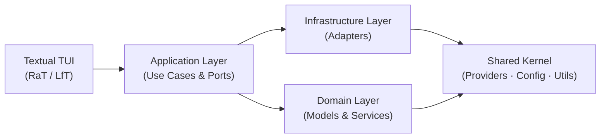

# Memosyne

<div align="center">

**基于 LLM 的术语处理、双语 Quiz 解析工具包**

[](https://www.python.org/)
[](LICENSE)
[]()
[]()

*领域驱动设计、类型安全、生产就绪的 LLM 工作流工具*

[特性](#-特性) • [快速开始](#-快速开始) • [架构](#-架构详解) • [API 指南](#-api-使用指南) • [安装](#-安装)

</div>

---

## 📖 简介

Memosyne 是一个基于领域驱动设计（DDD）和六边形架构的 LLM 术语处理和 Quiz 解析工具包，提供两个核心功能：

> 📓 最新更新记录请查看 [CHANGELOG](CHANGELOG.md)，详细的 TUI 迭代日志整理自 `TUI_design_note/`。

### 🔤 **Reanimator - 术语重生器**
将术语列表（英文单词 + 中文释义）扩展为完整的记忆卡片信息：
- 音标（IPA）
- 词性（POS）
- 英文定义（EnDef）
- 例句（Example）
- 词根词缀（PPfix/PPmeans）
- 领域标签（TagEN/TagCN）
- Memo ID 和批次管理

### 📝 **Lithoformer - Quiz 重塑器**
将 Markdown 格式的 Quiz 文档解析为结构化的 ShouldBe.txt 格式，支持：
- 多选题（MCQ，支持 A-Z 任意数量的字母选项）
- 填空题（CLOZE）
- 自动题目验证和格式化
- 逐题输出原文 + 简体中文翻译，并追加批次号与 `L` 系列题目编码
- 解析字段采用 `((中文术语::[English original]))` 形式标注专业名词，仅在首次出现时标注，便于记忆并避免重复
- 单题 LLM 调用最长 5 分钟，超时会自动消耗一次 `max_retries` 并重新解析，防止任务卡死

---

## ✨ 特性

### 🏗️ **生产级架构**

- ✅ **DDD + Hexagonal Architecture** - 领域驱动设计 + 六边形架构
- ✅ **Bounded Contexts** - Reanimator 和 Lithoformer 作为独立子域
- ✅ **Ports & Adapters** - 清晰的端口和适配器分离
- ✅ **Dependency Inversion** - 核心业务不依赖外部实现
- ✅ **SOLID 原则** - 单一职责、开放封闭、依赖倒置
- ✅ **类型安全** - Pydantic 2.x 运行时验证
- ✅ **依赖注入** - 无全局状态，完全可测试
- ✅ **统一日志系统** - 使用 logging 模块，支持多种输出格式
- ✅ **Token 追踪** - 完整的 Token 使用量统计和实时显示

### 🔌 **灵活扩展**

- ✅ 支持 **OpenAI** 和 **Anthropic** 双 Provider
- ✅ 统一的 LLM 接口，轻松添加新 Provider
- ✅ 可配置的模型、温度、重试策略
- ✅ 子域独立管理业务逻辑（Prompts/Schemas）

### 💻 **使用方式**

- ✅ **Textual TUI** - `python -m memosyne.reanimator.tui.app` / `python -m memosyne.lithoformer.tui.app`
- ✅ **便捷脚本** - `./scripts/RaT.sh`（Reanimator） / `./scripts/LfT.sh`（Lithoformer）
- ℹ️  CLI 与编程 API 已移除，所有操作统一通过 TUI 完成

### 📊 **完善的数据流**

- ✅ CSV 输入/输出（Reanimator）
- ✅ Markdown 输入 / TXT 输出（Lithoformer）
- ✅ 自动批次 ID 生成（格式：YYMMDD + RunLetter + Count）
- ✅ 智能文件命名（BatchID-FileName-ModelCode.ext）
- ✅ 防重名输出路径
- ✅ Lithoformer 输出原文与简体中文翻译逐行交织，附带批次号与题目唯一编码（Lxxxxxx）
- ✅ Prompt 片段版本化存放于 `stat.db`，运行时使用最新 system/user prompt 组合，便于灰度与回滚
- ✅ TUI 终端日志写入 `lithoformer_terminal_logs`，保留原始 logger 并清洗 message，支持后续可视化分析

---

### Lithoformer 输入/输出规范

**📥 输入 Markdown（每题一对代码块）**

```Question
Unlike fear, panic __________.
    a. is present oriented
    b. occurs in the absence of a "real" threat
    c. is future oriented
    d. involves autonomic nervous system (ANS) arousal
```

```Answer
b
```

- `Question` 代码块中保留题干与选项的原始排版（缩进、空行、图片占位等均可）。
- `Answer` 代码块填写标准答案：选择题写字母、填空题写正确填空（多空以逗号/换行分隔）、排序题写顺序（如 `B,A,C,D`）。
- 可在代码块前保留 `## 章节/题号` 等标题，Lithoformer 会自动带入上下文信息。
- 兼容性：历史数据使用的 ` ```Gezhi` 格式仍可解析，但建议尽快迁移到新的 `Question/Answer` 语法。
- LLM 将根据扩展 Schema 同步返回英文字段与 `*_translation` 字段；Formatter 会逐行交织原文与译文。

**📤 输出示例（ShouldBe.txt 片段，逐行中英双语）**

```
<b>Chapter 5 Quiz:<br>Anxiety and Obsessive-Compulsive and Related Disorders</b><br><br>[Unlike fear, panic __________.<br>((::与恐惧不同，惊恐 __________。))<br>A. is present oriented<br>((::是指向当下的体验。))<br>B. occurs in the absence of a "real" threat<br>((::在没有“真实”威胁的情况下仍然发生。))<br>C. is future oriented<br>((::是指向未来的体验。))<br>D. involves autonomic nervous system (ANS) arousal<br>((::会涉及自主神经系统的激活。))<br>]::(B)<br><br>[[解析::<br><div>领域：Anxiety Disorders</div><div>为什么选 b（occurs in the absence of a "real" threat<br>((::因为惊恐可在缺乏真实威胁的情况下发生。))）</div><div>惊恐发作的核心特点是突发性强烈恐惧、伴随自主神经反应，即便客观环境并不存在真实危险。</div><div><br></div><div>相关知识：</div><div>惊恐障碍患者常因“下一次发作”而形成广场恐惧（agoraphobia），避免身处难以逃离的场景。</div><div>DSM-5-TR 将惊恐障碍与广场恐惧症拆分为独立诊断，但临床中高度共病，需要分别评估。</div><div><br></div><div>其他选项为什么不如 b：</div><div>A. 恐惧与惊恐都可以发生在当下；差异在于是否存在现实威胁。</div><div>C. “未来取向”是焦虑（anxiety）的特征描述，而非惊恐。</div><div>D. 自主神经激活对恐惧与惊恐而言都可能出现，不足以区分。</div>]]<br>
```

> 每题输出包含：原题 → 标准答案 → 自动生成的领域分析、关键知识点和错误选项逐条解析。

---

## 🚀 快速开始

### 方式 1：模块执行（推荐）

```bash
# Reanimator TUI
python -m memosyne.reanimator.tui.app

# Lithoformer TUI
python -m memosyne.lithoformer.tui.app
```

### 方式 2：便捷脚本

```bash
# Reanimator Textual TUI（自动调整终端尺寸）
./scripts/RaT.sh

# Lithoformer Textual TUI
./scripts/LfT.sh
```

### 配置

- `.env` 仅包含敏感密钥（`OPENAI_API_KEY`、`ANTHROPIC_API_KEY` 可选、`DEFAULT_TEMPERATURE` 可选）。
- 其它运行参数统一保存在 `db/config.db`：
  - `config` 表：`default_model`, `max_concurrent`, `max_retries`, `lithoformer_input_dir`, `lithoformer_output_dir` 等
- `feature` 表（单行）：`enable_translation`, `enable_parsing`, `enable_concurrent`
- TUI 的“配置/功能”选项卡读写上述配置；默认模型仅在“配置”Tab保存（下拉切换不落库）。
- 统计与 Prompt 数据集中存放在 `db/stat.db`：
  - `lithoformer_processing_logs`：顺序/并发处理流水及 Token 统计
  - `lithoformer_bank`：题库缓存（按题号去重）
  - `lithoformer_terminal_logs`：终端日志（含 `logger` 列，message 已去除时间戳/级别，自动过滤 httpx 噪声）
  - `lithoformer_prompts`：按版本保存的六段 prompt 片段，运行时总是加载最新版本
- Lithoformer 解析日志沿用 TUI 检测阶段的 `question_number`（顺序/并发模式均支持）；若缺失则回退到序号字符串，写库时批次号仅保留文件名首段（例如 `251030E006`），便于筛选与对账。

---

## 🖥️ Lithoformer TUI 概览

### Layout v2 Highlights (v0.10.3–v0.10.5a)

- 三列固定布局（760 / 560 / 280）直接对应 `layout.xml`，所有控件独立挂载，无容器嵌套，复刻 JiraTUI 的信息密度。
- 全量迁移至 `lithoformer_layout.tcss`，统一 round 边框、焦点状态与 Select 箭头配色，去除多余的 “输入/自动推断” 子标题。
- 自定义 `CustomProgressBar` 显示运行时间、预估剩余、Token 总数，并根据终端宽度动态调整进度条长度与百分比位置。
- Provider / Model 下拉支持搜索与自动填值；序号与批次号共享一行；Detect/Start 按钮固定在目录树下方。
- `RichLog` 标题明确为 “控制台”，命令输入高度提升至 3，并支持 `/clear`、`/exit` 指令，保留最近 999 条日志。

### 核心组件

- `MainScreen` — 负责 Detect → Start 状态机、异步任务、自动填值与手动覆盖跟踪。
- `CustomProgressBar` — 三行进度展示组件（运行时间 / 进度条 / 百分比随条移动）。
- `QuestionsTable` — 固定宽高的题目表格，禁用表头排序，状态色编码。
- `filters.py` — 13 个独立输入组件（路径、厂商、模型、标题、序号、批次、输出文件名、备注等），`TitleInput` 使用 `\n` 表示换行（首行自动加粗），`NoteInput`（显示为“备注”）的内容会追加到 LLM user prompt（可选）。
- `logging_utils.py` — Textual 原生日志 handler，与 RichLog 及命令输入联动。

### 操作体验

- **单键流程**：操作键在 `Detect → START → RUNNING` 之间循环；Detect 阶段仅做 Markdown 分析（标题 / 序号 / 批次 / 输出文件名），不会调用 LLM。
- **题目表格**：逐题展示 `Pending / In Progress / Done / ERROR` 状态、题型、字符数、输出字符数、耗时；失败题目标记为 `ERROR` 并在日志中记录原因。
- **文件树**：仅枚举选定输入目录下的 `.md` 文件；选中文件后可保留或覆盖自动推断字段，目录路径随时可切换。
- **输出管线**：解析完成后写出逐行中英双语的 ShouldBe.txt，并在日志中汇报批次号与 `L` 编码范围，便于追踪与验收。

> 详尽的重构背景、设计决策与测试记录见 `REFACTOR_REPORT.md` 与 `TUI_design_note/` 系列文档。

---

## 📦 安装

### 1. 克隆仓库

```bash
git clone <repository-url>
cd Memosyne
```

### 2. 创建虚拟环境

```bash
python -m venv .venv
source .venv/bin/activate  # macOS/Linux
# 或
.venv\Scripts\activate     # Windows
```

### 3. 安装依赖

```bash
pip install -r requirements.txt
```

### 4. 配置环境变量

复制 `.env.example` 文件并填入你的 API 密钥：

```bash
cp .env.example .env
# 编辑 .env 文件
```

`.env` 文件示例：

```env
# === LLM API 密钥（必填）===
OPENAI_API_KEY=your-openai-api-key-here
ANTHROPIC_API_KEY=your-anthropic-api-key-here  # 可选

# === 默认模型配置 ===
DEFAULT_LLM_PROVIDER=openai
DEFAULT_OPENAI_MODEL=gpt-4o-mini
DEFAULT_ANTHROPIC_MODEL=claude-sonnet-4-5
DEFAULT_TEMPERATURE=

# === 业务配置 ===
BATCH_TIMEZONE=America/New_York
MAX_BATCH_RUNS_PER_DAY=26
REANIMATOR_TERM_LIST_VERSION=1

# === 日志配置 ===
LOG_LEVEL=INFO
LOG_FORMAT=console
```

**注意**: `.env` 文件已在 `.gitignore` 中，绝不能提交到版本控制。

### 5. （可选）自定义输入/输出路径

项目默认的示例文件位于 `misc/` 目录，配置文件 `config/paths.json` 会指向该目录。
这些示例是只读的，TUI 遇到写入请求时会提示你选择真正的输出目录。

如需将默认输入或输出切换到团队自己的共享目录，修改 `config/paths.json`（或通过
环境变量 `REANIMATOR_INPUT_DIR` / `REANIMATOR_OUTPUT_DIR` / `LITHOFORMER_*` 覆盖），示例：

```json
{
  "base_dir": "misc",
  "reanimator": {
    "input": "/Users/me/datasets/reanimator_input",
    "output": "/Users/me/datasets/reanimator_output"
  },
  "lithoformer": {
    "input": "/Users/me/datasets/lithoformer_input",
    "output": "/Users/me/datasets/lithoformer_output"
  }
}
```

> 提醒：如果仍指向 `misc/`，运行时会提示“示例目录只读”并要求你提供实际路径。

---

## 🏛️ 架构详解

### 架构概览

Memosyne v0.10.5a 采用**领域驱动设计（DDD）**和**六边形架构（Hexagonal Architecture，又称端口适配器模式）**，确保代码的可维护性、可测试性和可扩展性。

#### 核心架构模式

1. **Domain-Driven Design (DDD)** - 领域驱动设计
   - **Bounded Context**（限界上下文）：Reanimator 和 Lithoformer 作为独立子域
   - **Shared Kernel**（共享内核）：业务无关的基础设施代码
   - **Layered Architecture**（分层架构）：Domain → Application → Infrastructure → TUI

2. **Hexagonal Architecture** - 六边形架构
   - **Ports**（端口）：应用层定义的接口（Protocol）
   - **Adapters**（适配器）：基础设施层的具体实现
   - **依赖倒置**：核心业务不依赖外部实现

3. **SOLID 原则**
   - 单一职责原则 (SRP)
   - 开放封闭原则 (OCP)
   - 里氏替换原则 (LSP)
   - 接口隔离原则 (ISP)
   - 依赖倒置原则 (DIP)

#### 4. 双语输出流水线

- LLM 端严格遵循扩展后的 JSON Schema，同步返回英文字段及 `*_translation` 对应字段。
- Application 层在 `ParseQuizUseCase` 中做结构归一化（数量对齐、去除空白），保证译文与原文一一对应。
- Infrastructure 层 `QuizFormatter` 负责将原文与译文逐行交织输出，并附带批次号与 `L` 系列题目代码，确保下游无需再次对齐。

### DDD 分层架构

```
┌─────────────────────────────────────────────────────────┐
│                     TUI Layer                           │  用户接口
│        (reanimator/tui/app.py, lithoformer/tui/app.py)  │
├─────────────────────────────────────────────────────────┤
│              Infrastructure Layer (Adapters)            │  适配器实现
│    (llm_adapter, csv_adapter, file_adapter, ...)        │
├─────────────────────────────────────────────────────────┤
│           Application Layer (Use Cases + Ports)         │  业务协调
│  (ProcessTermsUseCase, ParseQuizUseCase, Ports)         │
├─────────────────────────────────────────────────────────┤
│           Domain Layer (Models + Services)              │  核心业务逻辑
│   (TermInput/Output, QuizItem, business rules)          │
├─────────────────────────────────────────────────────────┤
│        Shared Kernel (Core + Shared Infrastructure)    │  共享基础设施
│  (TokenUsage, ProcessResult, Config, LLM Providers)     │
└─────────────────────────────────────────────────────────┘
```

#### 各层职责

| 层级 | 职责 | 依赖方向 |
|------|------|---------|
| **Domain** | 核心业务逻辑、领域模型、领域服务 | 不依赖任何层 |
| **Application** | 业务流程编排、用例协调、端口定义 | 依赖 Domain |
| **Infrastructure** | 外部系统适配、LLM 调用、文件 I/O | 实现 Application Ports |
| **TUI** | 用户接口、依赖注入、流程调度 | 依赖所有层 |

### 核心设计原则

#### 1. 依赖倒置原则 (DIP)

**核心规则**：高层模块不依赖低层模块，都依赖抽象。

```python
# ✅ 正确：Application 层定义端口接口
class LLMPort(Protocol):
    def process_term(self, word: str, zh_def: str) -> tuple[dict, dict]:
        ...

class ProcessTermsUseCase:
    def __init__(self, llm: LLMPort):  # 依赖抽象
        self.llm = llm

# ✅ 正确：Infrastructure 层实现端口
class ReanimatorLLMAdapter:  # 实现 LLMPort
    def process_term(self, word: str, zh_def: str) -> tuple[dict, dict]:
        # 注入 Reanimator 专用的 prompts 和 schemas
        ...
```

#### 2. 子域隔离原则

**核心规则**：每个子域（Bounded Context）独立管理自己的业务逻辑。

```
Reanimator 子域：
- 领域模型：TermInput, LLMResponse, TermOutput
- 业务规则：词组标记、缩写处理、Memo ID 生成
- Prompts/Schemas：术语专用提示词和 JSON Schema

Lithoformer 子域：
- 领域模型：QuizItem, QuizOptions
- 业务规则：题目验证、Markdown 分割、标题推断
- Prompts/Schemas：Quiz 解析专用提示词和 JSON Schema
```

#### 3. Shared Kernel 原则

**核心规则**：共享内核只包含业务无关的基础设施。

```python
# ✅ 允许放入 Shared Kernel
- TokenUsage（通用数据模型）
- ProcessResult[T]（通用结果容器）
- OpenAIProvider（通用 LLM 提供商，无业务逻辑）
- BatchIDGenerator（通用批次 ID 生成器）
- Progress（通用进度条工具）

# ❌ 不允许放入 Shared Kernel
- REANIMATER_SYSTEM_PROMPT（业务相关，属于 reanimator 子域）
- LITHOFORMER_USER_TEMPLATE（业务相关，属于 lithoformer 子域）
- QuizFormatter（依赖 QuizItem 领域模型，属于 lithoformer 子域）
```

### 项目结构

```
src/memosyne/
├── core/                           # 核心层（抽象接口、核心模型）
│   ├── interfaces.py               # LLMProvider Protocol/ABC, 异常定义
│   └── models.py                   # TokenUsage, ProcessResult[T]
│
├── shared/                         # 共享内核（Shared Kernel）
│   ├── config/                     # Pydantic Settings
│   ├── utils/                      # 通用工具（batch, logger, progress, path, model_codes）
│   ├── tui/                        # Textual 共用 Widget（RateLimitBar、CustomProgressBar 等）
│   └── infrastructure/             # 业务无关的基础设施
│       ├── llm/                    # OpenAI/Anthropic Provider（通用）
│       ├── storage/                # CSV/TermList Repository
│       └── logging/                # 日志
│
├── reanimator/                     # Reanimator 子域（Bounded Context）
│   ├── domain/                     # 领域层
│   │   ├── models.py               # TermInput, LLMResponse, TermOutput
│   │   └── services.py             # apply_business_rules, get_chinese_tag, generate_memo_id
│   ├── application/                # 应用层
│   │   ├── ports.py                # LLMPort, TermListPort（端口接口）
│   │   └── use_cases.py            # ProcessTermsUseCase（用例）
│   ├── infrastructure/             # 基础设施层
│   │   ├── llm_adapter.py          # ReanimatorLLMAdapter（注入 prompts/schemas）
│   │   ├── prompts.py              # REANIMATER_SYSTEM_PROMPT
│   │   ├── schemas.py              # TERM_RESULT_SCHEMA
│   │   ├── csv_adapter.py          # CSVTermAdapter
│   │   └── term_list_adapter.py    # TermListAdapter
│   └── tui/                        # Reanimator Textual TUI（app.py, widgets, css）
│
├── lithoformer/                    # Lithoformer 子域（Bounded Context）
│   ├── domain/                     # 领域层
│   │   ├── models.py               # QuizItem, QuizOptions（含翻译字段）
│   │   └── services.py             # split_markdown, infer_titles, is_quiz_item_valid
│   ├── application/                # 应用层
│   │   ├── ports.py                # LLMPort（端口接口）
│   │   └── use_cases.py            # ParseQuizUseCase（用例）
│   ├── infrastructure/             # 基础设施层
│   │   ├── llm_adapter.py          # LithoformerLLMAdapter（动态生成 prompts/schemas）
│   │   ├── prompts.py              # 动态 system prompt 构建器（从 DB 读取最新片段）
│   │   ├── prompt_defaults.py      # Prompt 片段默认值（首次启动写入 stat.db）
│   │   ├── schemas.py              # 动态 JSON Schema 构建器（含翻译字段）
│   │   ├── file_adapter.py         # FileAdapter
│   │   ├── formatter_adapter.py    # FormatterAdapter
│   │   └── formatters/             # QuizFormatter（依赖领域模型）
│   └── tui/                        # Lithoformer Textual TUI（app.py, widgets, css）

config/
└── paths.json                      # 默认路径配置（可自定义到非 misc 目录）

misc/
├── input/
│   ├── reanimator/                 # Reanimator 示例 CSV（只读模板）
│   ├── lithoformer/                # Lithoformer 示例 Markdown
│   └── ARCHIVED/                   # 历史示例
└── output/                         # 示例输出（只读，不会写入）
    ├── reanimator/
    ├── lithoformer/
    └── archived/

db/
├── config.db                       # AppConfigService 数据库（config/feature 表）
├── stat.db                         # 统计与 prompt 版本（processing_logs/bank/terminal_logs/prompts）
├── term_list_v1.csv                # 术语表（英文→两字中文）
└── reanimator_db/                  # Reanimator 数据库文件
```

## 🗂️ 版本历史（自 v0.9.0）

> 更完整的更新记录见 [CHANGELOG](CHANGELOG.md)。

- **v0.15.1** — Lithoformer Prompt 片段迁移至 `stat.db` 的版本表，运行时自动拼装最新 system/user prompt；终端日志新增 `logger` 列并清洗消息文本，同时过滤 httpx 噪声；文档同步对齐新配置。
- **v0.10.5a** — Lithoformer TUI 第三轮布局修复：三列比例完全对齐 `layout.xml`，自适应进度条显示运行/剩余时间与 Tokens，Select 下拉样式恢复 JiraTUI 风格，按钮与批次号输入定位稳定。
- **v0.10.4** — 新增 `lithoformer_layout.tcss` 与 Textual 日志集成；Detect/Start 状态机、问题表格宽度和命令输入区布局全部更新。
- **v0.10.3** — 完整重写 TUI Compose 逻辑，落地 layout.xml 三列设计；Provider/Model 选择器支持搜索与自动填值；Detect 阶段生成 `DetectionResult` 快照。
- **v0.10.1a** — Lithoformer 输出升级为逐行双语；Schema 新增翻译字段，TUI 全链路附带批次号与题目 `L` 编码；QuizFormatter 实现原文与译文交织。
- **v0.9.2** — Lithoformer TUI 全面重写，采用 JiraTUI 布局，支持 Detect/Start 双阶段、实时日志与题目表格。
- **v0.9.1a** — 扩充测验数据集，导入新的 Markdown 题库文件。
- **v0.9.1** — 标记生产就绪，完成 UI 层、批次 ID、日志追踪与错误处理能力建设（早期 CLI/API 已在 v0.16 前淘汰）。
- **v0.9.0** — 引入 DDD + Hexagonal 架构，确立 Reanimator / Lithoformer 子域与共享内核。

### 架构图表

#### 系统架构（简化）


```mermaid
flowchart LR
    TUI["Textual TUI<br/>(RaT / LfT)"]
    App["Application Layer<br/>(Use Cases & Ports)"]
    Infra["Infrastructure Layer<br/>(Adapters)"]
    Domain["Domain Layer<br/>(Models & Services)"]
    Shared["Shared Kernel<br/>(Providers · Config · Utils)"]

    TUI --> App
    App --> Domain
    App --> Infra
    Infra --> Shared
    Domain --> Shared
```

**关键规则**
- ✅ TUI 仅与 Application 层交互
- ✅ Infrastructure 实现 Application 定义的端口接口
- ✅ Domain 层不依赖外层，保持业务纯净
- ❌ Shared Kernel 不包含任何子域业务逻辑（Prompt、Schema 等需留在子域）

#### 子域组件速览

**Reanimator（术语重生器）**

| 层级 | 关键组件 |
|------|-----------|
| Domain | `TermInput` / `TermOutput`；`apply_business_rules`、`generate_memo_id` 等领域服务 |
| Application | `ProcessTermsUseCase`；端口接口 `LLMPort`、`TermListPort` |
| Infrastructure | `ReanimatorLLMAdapter`、`CSVTermAdapter`、`TermListAdapter`、`REANIMATER_SYSTEM_PROMPT`、`TERM_RESULT_SCHEMA` |
| TUI | `reanimator/tui/app.py`、`scripts/RaT.sh` |

**Lithoformer（Quiz 重塑器）**

| 层级 | 关键组件 |
|------|-----------|
| Domain | `QuizItem`（含翻译字段）、`QuizAnalysis`；`split_markdown_into_questions`、`infer_titles_from_markdown`、`infer_question_seed`|
| Application | `ParseQuizUseCase`（对齐翻译字段、累计 Token）；端口接口 `LLMPort` |
| Infrastructure | `LithoformerLLMAdapter`、`FileAdapter`、`FormatterAdapter`、`prompts.get_dynamic_system_prompt()`、`schemas.get_dynamic_schema()` |
| TUI | `lithoformer/tui/app.py`、`scripts/LfT.sh` |

**Shared Kernel**

| 模块 | 说明 |
|------|------|
| Config & Settings | `.env` 驱动的 `Settings` 单例，集中管理目录/密钥 |
| Utils | `BatchIDGenerator`、`Progress`、`model_codes`、`path` 等通用工具 |
| LLM Providers | `OpenAIProvider`、`AnthropicProvider`（不包含任何业务逻辑） |
| Core Models | `TokenUsage`、`ProcessResult[T]` |

### 设计决策

#### 1. 为什么采用 DDD + Hexagonal Architecture？

**问题**：如何构建可维护、可测试、可扩展的大型系统？

**决策**：采用 DDD 和六边形架构

**理由**：
- ✅ **业务隔离**：每个子域独立管理自己的业务逻辑
- ✅ **高内聚低耦合**：核心业务逻辑不依赖外部实现
- ✅ **易于测试**：可以 mock 端口接口，测试用例
- ✅ **易于扩展**：新增 Provider 只需实现端口接口
- ✅ **团队协作**：不同子域可以并行开发

#### 2. 为什么将 Prompts 和 Schemas 放入子域？

**问题**：LLM Prompts 和 JSON Schemas 应该放在哪里？

**决策**：放入各自子域的 Infrastructure 层

**理由**：
- ❌ **不应放入 Shared Kernel**：Prompts 和 Schemas 包含业务逻辑，违反 Shared Kernel 原则
- ✅ **属于子域业务**：Reanimator 的 prompts 专门用于术语处理，Lithoformer 的 prompts 专门用于 Quiz 解析
- ✅ **依赖注入**：Adapter 负责注入 Prompts 和 Schemas 到通用 Provider

**实现**：
```python
# Shared Kernel: 通用 Provider（无业务逻辑）
class OpenAIProvider:
    def complete_structured(
        self,
        system_prompt: str,  # 由外部注入
        user_prompt: str,    # 由外部注入
        schema: dict,        # 由外部注入
        schema_name: str = "Response"
    ) -> tuple[dict, TokenUsage]:
        ...

# Reanimator Infrastructure: 注入业务相关的 prompts
class ReanimatorLLMAdapter:
    def process_term(self, word: str, zh_def: str) -> tuple[dict, dict]:
        system_prompt = REANIMATER_SYSTEM_PROMPT  # 子域专用
        user_prompt = REANIMATER_USER_TEMPLATE.format(word=word, zh_def=zh_def)

        llm_response, token_usage = self.provider.complete_structured(
            system_prompt=system_prompt,
            user_prompt=user_prompt,
            schema=TERM_RESULT_SCHEMA["schema"],  # 子域专用
            schema_name="TermResult"
        )
        return llm_response, token_usage
```

#### 3. 为什么将 QuizFormatter 移到 Lithoformer 子域？

**问题**：QuizFormatter 最初在 Shared Kernel，但造成循环依赖。

**决策**：移到 Lithoformer Infrastructure 层

**理由**：
- ❌ **DDD 违规**：QuizFormatter 依赖 QuizItem 领域模型，不应放在 Shared Kernel
- ✅ **领域专属**：Quiz 格式化是 Lithoformer 子域的业务需求
- ✅ **避免循环依赖**：Shared Kernel 不应依赖子域模型

**重构过程**：
```
旧位置：shared/utils/quiz_formatter.py
       ↓ (循环依赖)
   QuizItem ← quiz_formatter ← lithoformer ← formatter_adapter ← quiz_formatter

新位置：lithoformer/infrastructure/formatters/quiz_formatter.py
       ✓ (单向依赖)
   QuizItem ← quiz_formatter
```

#### 4. 为什么使用 Protocol 而非 ABC？

**问题**：如何定义端口接口？

**决策**：Application 层使用 Protocol，Shared Kernel 使用 ABC

**理由**：
- **Protocol**（鸭子类型）：
  - 支持隐式实现，无需显式继承
  - 适合 Application 层的端口接口
  - 更灵活，便于测试 mock

- **ABC**（抽象基类）：
  - 显式继承，强制实现抽象方法
  - 适合 Shared Kernel 的 Provider 基类
  - 提供模板方法模式和共享代码

#### 5. 为什么使用 Pydantic？

**问题**：如何确保数据的类型安全和运行时验证？

**决策**：使用 Pydantic 2.x

**理由**：
- ✅ 运行时类型验证
- ✅ 自动数据转换
- ✅ 清晰的错误信息
- ✅ IDE 类型提示支持
- ✅ JSON Schema 生成（用于 LLM）

#### 6. 为什么采用依赖注入？

**问题**：如何避免全局状态和硬编码依赖？

**决策**：通过构造函数注入所有依赖

**理由**：
- ✅ 可测试性：轻松 mock 依赖
- ✅ 灵活性：运行时选择不同实现
- ✅ 清晰性：依赖关系显式声明

**示例**：
```python
# ❌ 不好：全局状态
llm = OpenAI()  # 全局变量

def reanimate(word):
    return llm.call(word)  # 隐式依赖

# ✅ 好：依赖注入
class ProcessTermsUseCase:
    def __init__(self, llm: LLMPort):  # 显式依赖
        self.llm = llm

    def execute(self, terms):
        return self.llm.process_term(...)
```

### 扩展性

#### 添加新的 LLM Provider

**步骤**：
1. 在 `shared/infrastructure/llm/` 创建新 Provider 类
2. 继承 `BaseLLMProvider`
3. 实现 `complete_structured()` 方法
4. 在 `shared/infrastructure/llm/__init__.py` 导出

**无需修改子域代码**！

#### 添加新的子域（Bounded Context）

**步骤**：
1. 创建新子域目录：`src/memosyne/new_subdomain/`
2. 创建分层结构：
   - `domain/` - 领域模型和服务
   - `application/` - 用例和端口接口
   - `infrastructure/` - 适配器、Prompts、Schemas
   - `tui/` - Textual TUI（可选，自定义 app/widgets）
3. 在共享层（`shared/tui/` 等）复用需要的组件，或新增专属 Widget

**无需修改其他子域**！

#### 添加新的数据源

**步骤**：
1. 在子域的 Application 层定义新端口接口
2. 在子域的 Infrastructure 层实现新适配器
3. 在 Use Case 中注入新适配器

**无需修改领域逻辑**！

---

## 📖 API 使用指南

> v0.16 起项目仅保留 Textual TUI（`python -m memosyne.reanimator.tui.app` / `python -m memosyne.lithoformer.tui.app` 或 `./scripts/RaT.sh`、`./scripts/LfT.sh`）。原 CLI 入口与 `memosyne.api` 编程接口已下线，如需自动化请通过批处理文件驱动 TUI 或按需复用子域 Use Case。

## 💡 使用示例

### Reanimator - 批量处理术语

1. 运行 `./scripts/RaT.sh`，窗口将自动调整到 212 列。
2. 在右侧文件树中选择 `data/input/reanimator/221.csv` 并点击 `Detect`。
3. 检查批次号/输出文件名，如需备注可在“输入”Tab 填写；命令行 `/bank` 可快速查看最近写入的术语。
4. 点击 `Start` 后，TUI 会在底部进度条显示 Token、剩余时间，并将 Processing log 写入 `stat.db`。
5. 处理下一个 CSV 只需重复选择 + Detect + Start，序号、批次号会根据文件名自动推断。

### Lithoformer - 使用 Claude

1. 运行 `./scripts/LfT.sh`。
2. 在“输入”Tab 设置 `Provider=anthropic`，`Model=claude-sonnet-4-5`，选择 `misc/input/lithoformer/chapter3.md`。
3. `Detect` 预览题目后可在命令行输入 `/clear`、`/bank` 等指令，或按 `p/t/a` 切换功能开关。
4. `Start` 期间 RateLimitBar 会展示 Anthropics RPM/TPM，完成后输出文件命名为 `BatchId-文件名-模型.txt`，ShouldBe.txt 采用中英交织格式。

---

## 🔧 开发

### 代码风格

项目遵循：
- **PEP 8** - Python 代码风格
- **Type Hints** - 完整的类型注解
- **Docstrings** - Google 风格文档字符串
- **DDD 原则** - 领域驱动设计
- **SOLID 原则** - 单一职责、开放封闭、依赖倒置

### 添加新的 LLM Provider

1. 在 `shared/infrastructure/llm/` 创建新 Provider 类
2. 继承 `BaseLLMProvider`
3. 实现 `complete_structured()` 方法
4. 在 `shared/infrastructure/llm/__init__.py` 导出

示例：

```python
from ...core.interfaces import BaseLLMProvider, LLMError
from ...core.models import TokenUsage

class MyProvider(BaseLLMProvider):
    def __init__(self, model: str, api_key: str, temperature: float | None = None):
        self.client = MyClient(api_key=api_key)
        super().__init__(model=model, temperature=temperature)

    def complete_structured(
        self,
        system_prompt: str,
        user_prompt: str,
        schema: dict,
        schema_name: str = "Response"
    ) -> tuple[dict, TokenUsage]:
        """实现结构化输出（用于 Reanimator 和 Lithoformer）"""
        # 实现你的逻辑
        result = {...}
        tokens = TokenUsage(prompt_tokens=15, completion_tokens=25, total_tokens=40)
        return result, tokens
```

**无需修改子域代码**！

### 添加新的子域（Bounded Context）

1. 创建新子域目录：`src/memosyne/new_subdomain/`
2. 创建分层结构：
   - `domain/` - 领域模型和服务
   - `application/` - 用例和端口接口
   - `infrastructure/` - 适配器、Prompts、Schemas
   - `tui/` - Textual TUI（可选）
3. 在共享层按需新增 Widget / Provider，保持与 TUI 对齐

**无需修改其他子域**！

---

## 📊 性能

### Reanimator 处理速度

| 术语数量 | 模型 | 耗时 |
|---------|------|------|
| 36 | gpt-4o-mini | ~2 分钟 |
| 36 | claude-sonnet-4-5 | ~3 分钟 |
| 100 | gpt-4o-mini | ~5 分钟 |

### Lithoformer 解析速度

| 题目数量 | 模型 | 耗时 |
|---------|------|------|
| 15 | gpt-4o-mini | ~30 秒 |
| 50 | gpt-4o-mini | ~2 分钟 |

*注：速度取决于网络状况和 API 响应时间*

---

## 🐛 故障排除

### 问题：`ValidationError: Field required`

**原因**：`.env` 文件配置错误或 API Key 为空

**解决**：
1. 检查 `.env` 文件是否存在
2. 确保 `OPENAI_API_KEY` 已正确配置
3. 确保 API Key 长度 ≥ 20 字符

### 问题：`LLMError: OpenAI API 错误`

**原因**：API 调用失败（额度不足、网络问题等）

**解决**：
1. 检查 API Key 是否有效
2. 检查账户额度
3. 检查网络连接

### 问题：路径找不到

**原因**：输入文件路径错误

**解决**：
1. 使用相对路径时，文件应在 `misc/input/reanimator/` 或 `misc/input/lithoformer/`
2. 使用绝对路径确保路径正确
3. 检查文件名拼写

### 问题：如何更换 LLM 提供商？

**A**: 设置 `provider` 参数：

```python
# 使用 OpenAI（默认）
result = reanimate(..., provider="openai", model="gpt-4o-mini")

# 使用 Anthropic
result = reanimate(..., provider="anthropic", model="claude-sonnet-4-5")
```

确保 `.env` 中配置了相应的 API 密钥。

### 问题：支持哪些模型？

**OpenAI**：
- `gpt-4o-mini` （推荐，快速且便宜）
- `gpt-4o` （更强大，但成本更高）
- `o1-mini` （如需深度推理）

**Anthropic**（推荐使用官方别名，自动映射到最新版本）：
- `claude-sonnet-4-5` （推荐，最强大的 Claude 3.5 Sonnet）
- `claude-opus-4` （Claude 3 Opus）
- `claude-haiku-4` （Claude 3.5 Haiku，更快，成本更低）

也可使用完整版本号固定版本：
- `claude-3-5-sonnet-20240620`
- `claude-3-5-haiku-20241022`
- `claude-3-opus-20240229`

---

## 🤝 贡献

欢迎贡献！请遵循以下步骤：

1. Fork 项目
2. 创建功能分支 (`git checkout -b feature/AmazingFeature`)
3. 提交更改 (`git commit -m 'Add some AmazingFeature'`)
4. 推送到分支 (`git push origin feature/AmazingFeature`)
5. 开启 Pull Request

---

## 📚 文档

- **[AGENTS.md](AGENTS.md)** – AI 协作记忆（Claude/ChatGPT 等通用指引）
- 架构与 TUI 流程的详细说明已整合进本 README（参见目录链接）。

---

## 📝 变更日志

### v0.10.5a (2025-10-21)

**Lithoformer TUI 第三轮修复**

- ✨ 引入 `CustomProgressBar`，显示运行时间、剩余时间与 Token 累计，并根据终端宽度自适应进度条长度与百分比位置。
- 🛠️ 调整 `lithoformer_layout.tcss`，缩减输入组件间距，确保序号与批次号同列展示，Detect/Start 按钮固定在文件树底部。
- 🛠️ Select 下拉恢复 JiraTUI 风格的焦点与箭头；命令输入高度调至 3，`RichLog` 明确标注为 “控制台”。
- 🐞 修复模型下拉选择后仍显示占位文本的问题，并避免厂商下拉触发时清空模型列表。

### v0.10.4 (2025-10-20)

**Layout v2 正式落地**

- ✨ 新建 `lithoformer_layout.tcss`，按照 layout.xml 三列比例重写布局，移除嵌套容器，所有控件独立挂载。
- ✨ `logging_utils.py` 提供 Textual Handler，命令行支持 `/clear`、`/exit`，日志保留最近 999 条。
- 🛠️ Detect → START 状态机完善，自动重置进度条、累积 Token 统计；题目表格固定宽高并禁用列头排序。

### v0.10.3 (2025-10-19)

**Layout XML 对齐重构**

- ✨ 重写 `MainScreen.compose()` 以实现 760 / 560 / 280 三列布局；Provider/Model 选择器加入搜索与手动覆盖检测。
- ✨ Detect 阶段新增 `DetectionResult` 缓存，自动推断标题（支持 `\n` 表示换行）、序号、批次号、输出文件名。
- 📚 在 `TUI_design_note/` 中撰写 `DEVELOPMENT_REPORT_v0.10.3.md`、`LAYOUT_FIX_v1–v6.md` 记录每轮反馈与修复。

### v0.10.1a (2025-10-16)

**双语输出 & 题目元数据**

- ✨ Lithoformer LLM Schema 新增 `stem_translation`、`options_translation` 等字段，输出逐行中英双语。
- ✨ TUI 自动推算批次号与题目 `L` 编码，Formatter 在写出 ShouldBe.txt 时一并附加（历史 CLI/API 已在 v0.16 前移除）。
- 🛠️ `ParseQuizUseCase` 对译文字段做长度对齐和空白清洗，防止 Formatter 阶段出现错位。
- 🛠️ `QuizFormatter` 重写为行级交织逻辑，并在日志中记录输出统计。

### v0.9.2 (2025-10-15)

**Lithoformer TUI 重构**

- ✨ Textual TUI 参考 JiraTUI 进行 UI/交互重写，加入 Detect → START 双阶段流程与文件树选择。
- ✨ 新增实时日志、题目状态表、双进度条及命令输入区，默认保留最近 999 条记录。
- 🛠️ TUI 共享批次推断逻辑，支持 Detect 阶段轻量扫描，Start 阶段流式更新。

### v0.9.1a (2025-10-14)

**数据更新**

- ✨ 新增测验文件 `121.md`（35 道题目）及其解析输出

### v0.9.1 (2025-10-14)

**生产就绪版本**

- ✨ 添加多个测验文件（42, 45, 55, 59, 79, 82, 94, 97, 101 号测验）
- 🛠️ Lithoformer 领域服务优化

### v0.9.0 (2025-10-14)

**逐题解析与中文详解**

- ✨ **题目格式升级**：支持 ` ```Question` / ` ```Answer` 代码块输入，自动兼容旧的 ` ```Gezhi` 格式，并按题逐条调用 LLM。
- ✨ **医学级解析输出**：每道题新增 `analysis` 字段（领域、中文解析、关键知识点、干扰项理由），Formatter 生成 `[[解析:: ...]]` 区块。
- ✨ **Prompt & Schema 重写**：Lithoformer LLM 提示词聚焦临床心理学语境，强制返回中文解释，Schema 精简为单题 `QuizQuestion`。
- 🛠️ **进度反馈增强**：Shared `Progress` 展示速率与剩余时间，运行时显示当前题目所属领域。
- 📚 **文档更新**：README 补充新版输入/输出规范与简洁架构图，AGENTS.md 同步版本说明。

### v0.8.3 (2025-10-13)

**重大架构重构：DDD + Hexagonal Architecture**

- ✨ **架构升级**：
  - 采用领域驱动设计（DDD）：Bounded Contexts（Reanimator 和 Lithoformer）
  - 采用六边形架构（Hexagonal）：Ports & Adapters 模式
  - Shared Kernel：业务无关的基础设施层
  - 完整的 4 层分层：Domain → Application → Infrastructure → TUI

- ✨ **子域隔离**：
  - Prompts 和 Schemas 移到各自子域 Infrastructure 层
  - QuizFormatter 移到 Lithoformer 子域（避免循环依赖）
  - 每个子域独立管理自己的业务逻辑

- ✨ **依赖倒置**：
  - Application 层定义端口接口（Protocol）
  - Infrastructure 层实现适配器
  - Adapter 注入 Prompts/Schemas 到通用 Provider
  - Shared Kernel Provider 移除业务相关方法

- ✨ **新增能力**：
  - 逐题请求 LLM（Lithoformer）
  - 实时 Token 使用量显示
  - 进度条集成 Token 统计

- 📚 **文档更新**：
  - 完整的 DDD + Hexagonal 架构文档
  - 合并 ARCHITECTURE 和 API_GUIDE 到 README
  - 更新 AGENTS.md（原 CLAUDE.md）开发指南

### v0.7.1 (2025-10-11)

**深度重构：服务层统一与架构增强**

- ✨ **新增模块**：
  - `prompts/` - 集中管理 LLM 提示词（reanimater_prompts, lithoformer_prompts）
  - `schemas/` - 集中管理 JSON Schema（term_schema, quiz_schema）
  - `models/result.py` - TokenUsage 和 ProcessResult[T] 统一结果模型

- ✨ **服务层统一**：
  - Reanimater 和 Lithoformer 都添加 `from_settings()` 工厂方法
  - 统一方法名为 `process()`，返回 `ProcessResult[T]`
  - 进度条实时显示 Token 使用量（prompt/completion/total）
  - Lithoformer 支持文件路径输入（自动检测 Path vs 字符串）
  - 两个服务都支持 Logger 依赖注入

- ⚠️ **Breaking Changes**：
  - Provider 接口返回值改为 `tuple[dict, TokenUsage]`
  - OpenAIProvider 和 AnthropicProvider 都提取 token 使用量
  - 从新模块导入 prompts 和 schemas
  - 删除所有向后兼容别名（process_terms, parse_quiz）

- 📚 **文档更新**：
  - API_GUIDE.md - 删除向后兼容性章节，更新示例代码
  - ARCHITECTURE.md - 更新架构图、UML 类图、时序图
  - README.md - 更新项目结构和特性列表

### v0.6.2 (2025-10-10)

**架构增强与质量改进**

- ✨ 新增：统一日志系统（`utils/logger.py`），替换 print 为 logging
- ✨ 新增：Provider 抽象方法 `complete_structured()` 用于结构化输出
- ✨ 新增：`.env.example` 环境变量模板文件
- ✨ 新增：API_GUIDE.md 完整文档（40+ 示例）
- ✅ 改进：Lithoformer 添加结果校验，空题目列表会抛出错误
- ✅ 改进：Reanimater 添加告警日志（Example 与 EnDef 相同时）
- ✅ 改进：Reanimater 内存优化，避免强制转换迭代器为列表
- 🔧 修复：Lithoformer 破坏 Provider 抽象的问题，现使用统一接口
- 📚 文档：更新 AGENTS.md（原 CLAUDE.md）、ARCHITECTURE.md、README.md

### v2.0.0 (2025-10-07)

**重大重构**

- ✨ 全新架构：采用 SOLID 原则和分层设计
- ✨ 编程 API：提供 `reanimate()` 和 `lithoform()` 函数
- ✨ 类型安全：使用 Pydantic 2.x 进行数据验证
- ✨ 双 Provider：支持 OpenAI 和 Anthropic
- 🔧 修复：项目根目录检测 bug
- 🔧 修复：Pydantic v2 兼容性问题
- 📚 文档：新增 API_GUIDE.md、ARCHITECTURE.md
- 🗑️ 移除：旧版代码（`src/mms_pipeline/`, `src/exparser/`）

### v1.0.0 (2024-09)

- 初始版本
- 基础 Reanimater 和 Lithoformer 功能

---

## 📄 许可证

本项目采用 [MIT 许可证](LICENSE)。

---

## 🙏 致谢

- OpenAI - 提供强大的 GPT 系列模型
- Anthropic - 提供 Claude 系列模型
- Pydantic - 提供出色的数据验证框架

---

<div align="center">

**Made with ❤️ by Memosyne Team**

⭐ 如果这个项目对你有帮助，请给个星标！

</div>
